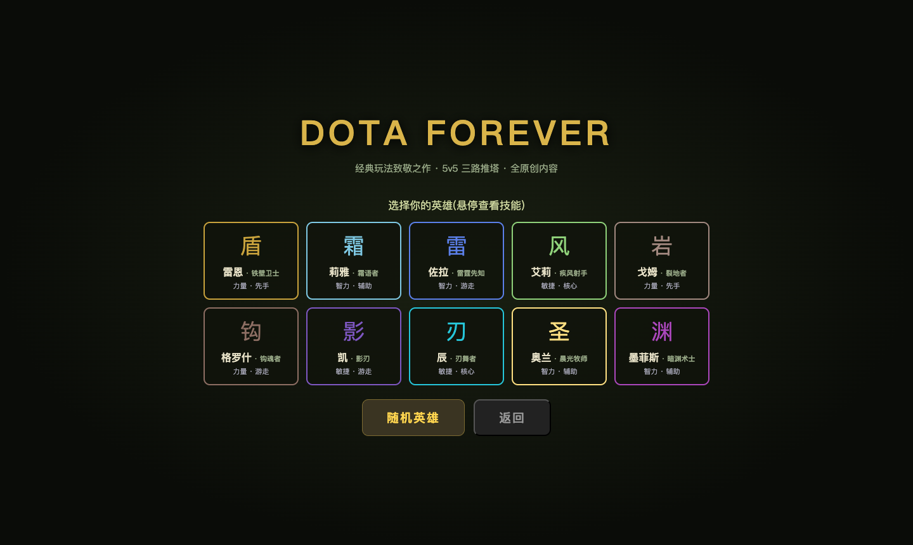
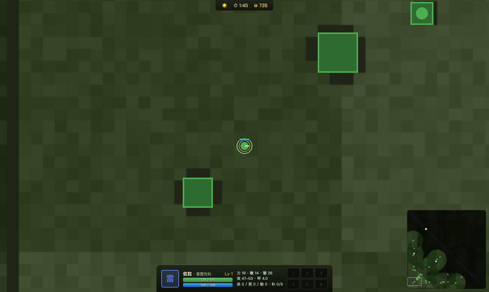
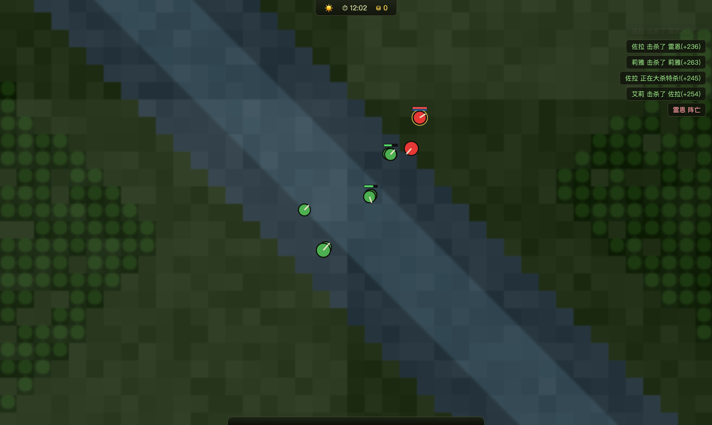

# DOTA FOREVER — 经典 DotA 1 玩法复刻

一个在浏览器里运行的经典 5v5 三路推塔对战游戏:正补反补、战争迷雾、昼夜交替、
神符野区、河道 Boss、装备合成、买活回城——完整复刻 DotA 1 时代的核心玩法体验。

**TypeScript + Canvas2D,零运行时依赖,389 项单元/仿真测试,AI 整局对战可分出胜负。**

> **内容边界声明**:本项目复刻的是**游戏机制**(规则与数值模型不受版权保护),
> 不包含任何受版权保护的内容——全部英雄、技能、物品的名称与文案均为原创,
> 美术为程序化绘制,音效为 WebAudio 合成,不使用任何暴雪/Valve 素材。



| 对局中(HUD + 小地图 + 技能/物品栏) | AI 观战对局 |
|---|---|
|  |  |

## 快速开始

```bash
npm install
npm run dev        # http://localhost:5180
```

- 主菜单选择英雄开始 5v5(你 + 9 个 AI),或观战纯 AI 对局。
- URL 参数:`?mode=play&hero=zola&seed=42&speed=1` / `?mode=spectate&speed=8`

```bash
npm test           # 全部单元与仿真测试(含一整局 AI 对战回归)
npm run batchsim   # 多种子整局平衡批跑(约 5 分钟)
npm run build      # 生产构建(tsc + vite)
```

## 操作(忠实经典)

| 按键 | 功能 |
|---|---|
| 右键 | 移动 / 攻击目标 |
| A + 左键 | 强制攻击(可反补血量<50%的己方小兵) |
| Q W E R | 技能(点目标技能朝鼠标位置快速施放) |
| 1–6 | 使用物品 |
| F | 商店面板(基地/秘密商店范围内购买) |
| B | 买活(阵亡时) |
| S / H | 停止 / 保持原地 |
| 空格 | 镜头回到英雄 |
| Tab | 记分板 |
| Alt+点小地图 | 发信号 |
| P / ESC | 暂停 / 菜单 |

## 已实现的经典机制

**战斗模型(WC3 风格)**
- 攻击类型 × 护甲类型克制矩阵(英雄/普通/穿刺/攻城/魔法 × 六种护甲)
- 护甲减伤公式 `0.06A/(1+0.06A)`、负甲增伤、英雄 25% 基础魔抗
- 三属性体系:力量(19 血/点)、敏捷(护甲+攻速)、智力(13 蓝/点),主属性加攻
- 攻击前摇/后摇、弹道飞行、闪避、暴击、吸血、纯粹伤害
- **低打高 25% 落空、低地看不见高地**(河道视野劣势是真实的)

**经济与成长**
- 正补得金、**反补**(敌方 0 金 + 50% 经验)、经验共享圈(1300)
- 击杀赏金随等级与连杀增长、死亡掉金、买活(等级² 定价)
- 等级 1–25,技能 4/4/4/3,大招 6/11/16,黄点属性加成 ×10

**地图与节奏**
- 15040² 世界、三路对称地图、河道、双方野区、高台基地(坡道入口)
- 兵线 90 秒首波、30 秒一波、每 7 波投石车、每 7.5 分钟成长
- 破兵营出超级兵、六营全破出精英兵;基地双塔不破主基地无敌
- 战争迷雾(已探索灰雾)、昼夜 5 分钟交替(夜晚视野骤减)
- 神符每 2 分钟(加速/双倍/恢复/隐身)、魔法药瓶可装符
- 双方野区 4+1 营地整分钟刷新、远古营地高魔抗
- **深渊领主**(河道 Boss):随时间成长,掉落**不灭之盾**(原地复活一次),8–11 分钟重生
- 防御塔仇恨规则(优先小兵、保护被打的英雄)、泉水高伤防御与回复光环

**物品系统(110+ 件,分批扩充中)**
- 基础散件 / 秘密商店高级件 / 配方卷轴自动合成(支持连锁合成,价格=部件和+卷轴)
- 主动控制:闪烁短刃(受伤锁 3 秒)、原力法杖(推动)、挽紧之杖(缠绕)、纷争面纱(沉默)、勇气勋章(破甲)、魔法免疫
- 硬控/团战主动:**妖术法球**(变形)、**飓风之杖**(旋风)、**深渊之刃**(无视魔免眩晕)、**虚空面纱**(削魔抗)、**洞察烟斗**(团队护盾)、**刷新之球**(重置冷却)、幽魂权杖(虚化)
- 法球特效:风暴之锤/雷神之锤(连锁闪电)、湮灭之刃(破甲)、寒霜之心(冰冷减速)、净魂之刃(燃魔)、辉光(灼烧)、吸血/暴击
- 核心终极:蝶舞之翼(闪避)、圣剑(+330 攻击)、先锋之盾(减伤)、神灭之球(法术爆发)、金箍棒/缚足锤(重击眩晕)
- 团队增益:梅肯斯姆(团队治疗)、远古战鼓(团队加速·充能)、莲花宝珠(护盾自净)
- 合成线:萨格之刃→赤红甲→天堂之戟(致残/缴械)、幻影斧(分身自净)、点金手(点化发育)、天鹰之戟→飓风长戟(攻击距离/推开)、法术之刃→以太之镜→奥术核心(法术增强)
- 升级控制:雷神枷锁(范围缠绕+连锁)、血棘(沉默+暴击)、银月之冠(破甲/强化)、静默之刃(隐身突袭)
- 团队装:深红甲盾(团队减伤)、卫士胫甲(团队治疗+驱散)、月之碎片(极致攻速)、阴邪之罐(灼伤/治疗)、支配头盔(吸血光环)
- 进阶主动:以太之刃(虚化)、流星锤(延迟范围晕)、否决坠饰(驱散禁锢)、永恒之纱(法术屏障)、渔叉(拉近自身)、风之波荡(自旋无敌)、散华/永世法衣
- 位移与续航:远行之靴(全图传送)、影锋/微光/诡计之雾(隐身)、血石、静谧之鞋
- 召唤物品:亡者之书(召唤随从);充能物品:魔棒(敌方施法积充能)、萃取之瓶
- 视域守卫(插眼)/ 岗哨守卫(真眼)/ 显影之尘 — 完整视野博弈
- 储藏处、出售半价返还、死亡购买入库

**英雄(76 名全原创,机制致敬经典原型,持续分批扩充中)**

每名英雄都有 3 个普通技能 + 1 个大招(QWER),含独立 AI 释放评分。支持的英雄机制涵盖:
先手开团 / 物理核心 / 法系爆发 / 治疗护盾 / 召唤(树人·守卫·亡魂)/ **幻象**(分身出伤打折受伤翻倍)/
嘲讽 / 反伤 / 换位 / 处决 / 流形变身 / 承伤减免 / 法术增强 / 强制黑夜 /
**多重施法**(技能概率连发)/ **劈砍强化**(武器溅射 buff)/ **巨型团控**(拉拽聚怪开团)/
**寒霜连锁**(弹道弹跳递增)/ **吞噬成长** / **末日**(沉默+缴械+灼烧)/ 海妖外壳(伤害减免+自净)/
**法力虚空**(按缺蓝爆发)/ **决斗**(1v1 锁定·胜者永久成长)/ **混沌幻象** / 齿轮钩索 /
**黑洞**(引导吸入+眩晕)/ 守护天使(团队物理免疫)/ 退化光环 /
**薄葬**(免死保命)/ **延迟激流** / 潮位标记(拉回原点)/ 技能箭矢(缚击/强力击)/
相位免疫 / 月影团队隐身 / 神之力量(攻击爆发)等。

部分代表英雄:

| 英雄 | 定位 | 招牌 |
|---|---|---|
| 雷恩·铁壁卫士 | 力量先手 | 雷霆战锤(投掷眩晕)/ 泰坦之力 |
| 格罗什·钩魂者 | 力量游走 | **锁链魂钩(把人拖回来)** / 碎骨肢解 |
| 佐拉·雷霆先知 | 智力爆发 | 连环闪电 / 静电场 / **雷神之怒(全图)** |
| 奥兰·晨光牧师 | 智力治疗 | 圣疗术 / 信仰守护(护盾)/ 神圣庇护(物免) |
| 邓肯·重装壁垒 | 力量坦克 | 战吼嘲讽 / 壁垒领域 |
| 萨娅·幻影舞者 | 敏捷幻象 | 虚影分身 / 残影闪 / 幻象大军 |
| 凯隆·神射手 | 敏捷核心 | 穿透射击 / **狙杀(超远程)** |
| 奈雅·自然先知 | 智力召唤 | 召唤树人 / 全图自然之怒 |
| 收割者·格里姆 | 力量消耗 | 缺血斩 / **死神收割(处决)** |
| 编织者·薇芙 | 敏捷游走 | 缩地隐身 / 双重攻击 / 时光倒流 |
| 玛格·巨角战兽 | 力量先手 | 穿刺冲撞 / 强化(劈砍)/ **两极反转(拉拽全场)** |
| 杜姆·噩梦领主 | 力量游走 | 吞噬成长 / 焦土 / **末日(沉默缴械灼烧)** |
| 恩尼·虚空使者 | 智力召唤 | 噩咒 / 亡魂召唤 / **黑洞(引导吸入团控)** |
| 里昂·决斗将军 | 力量决斗 | 强压 / 鼓舞冲锋 / **决斗(1v1 锁定·胜者永久成长)** |
| 戴泽·微光萨满 | 智力守护 | 剧毒之触 / **薄葬(免死)** / 暗影波 / 编织 |
| 斯文·流放骑士 | 力量核心 | 风暴之锤 / 战吼 / 巨力挥砍 / **神之力量** |
| 默罗·殁世巫师 | 智力法核 | 奥术天球 / **星体禁锢(放逐)** / 精神虚妄 |
| 班恩·噩梦祭司 | 智力控制 | 弱化 / 吸脑 / 噩梦(沉睡)/ **末日缠绕(引导)** |

> 完整 76 名见 `src/data/heroes/`(`index.ts` + `batch2~13.ts`),游戏内选人界面可查看全部技能 tooltip。

**AI(9 个 bot)**
- 三层决策:战略(分路/撤退/防守/集结)→ 战术(技能评分释放/目标选择)→ 微操(补刀反补窗口/推塔)
- 按定位出装(含合成链)、TP 防守基地、塔下危险规避
- 后期收敛:40 分钟后抱团推最薄弱一路 → 对局必然分出胜负(批跑验证 47–65 分钟)

## 架构

```
src/
  core/     vec2 · 种子随机(mulberry32) · 数学工具
  data/     balance.ts(全部数值单一真相源) · heroes/ · items · neutrals · mapLayout
  sim/      确定性 30Hz 定步模拟(不触 DOM):
            world(tick) → modifiers(万物皆 buff) → 兵线/AI → 指令/战斗 → 弹道 → 建筑 → 经济 → 视野
  render/   Canvas2D:地形离屏烘焙 / 实体 / 迷雾(低分辨率柔化)/ 小地图
  ui/       DOM HUD:面板 / 商店 / 记分板 / 击杀播报 / 结算 / 菜单
  audio/    WebAudio 程序化合成音效
tests/      389 项:战斗矩阵/经济/寻路/视野/技能/合成/野区/Boss/英雄技能/物品/整局仿真
```

关键设计:
- **Modifier 系统**承载一切状态(眩晕/减速/光环/DoT/护盾/隐身),技能=数据+行为函数
- **Order 指令系统**:人类输入与 AI 输出同构,天然支持回放与未来 lockstep 联机
- 模拟确定性:同种子同输入 → 逐 tick 一致(测试可精确断言)

## 有意的简化(与原作的差异)

- 数值为"经典近似"而非逐补丁精确(全部集中在 `src/data/balance.ts`,易调)
- 无信使:购物需在商店范围(TP 回家取装是节奏的一部分);死亡时购买进储藏处
- 神符走近自动拾取;有空药瓶时自动装瓶
- 树木不可砍伐、无录像回放系统(幻象与召唤物均已实现)
- 联机未实现(架构已预留确定性 lockstep 接口)

## 开发

数值调整只改 `src/data/balance.ts`;新英雄=新增 `src/data/heroes/*.ts` 数据文件;
新物品=追加 `src/data/items.ts` 条目(配方卷轴自动注册)。

```bash
npm run typecheck   # 严格 TS
npm test            # vitest
node scripts/shot.mjs <url> <out.png> [waitMs] [evalExpr]   # 自动化截图/冒烟
```
